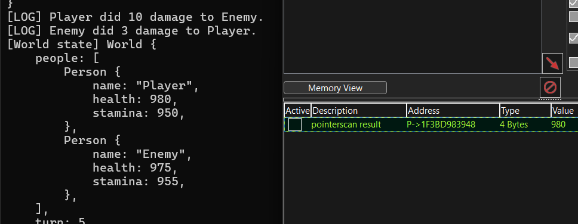
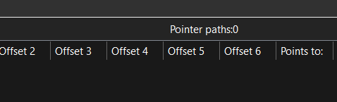
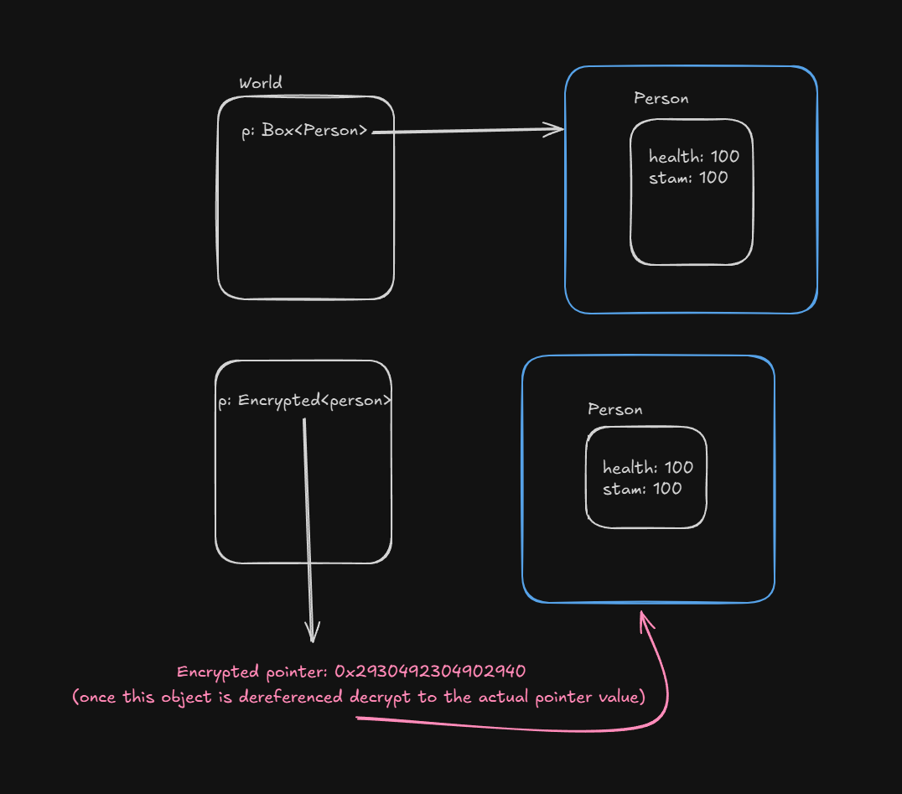

# pointerguard
Pointer encryption library in rust.

```rust
/// Example player struct.
struct Player {
  health: u32,
}

// turn box into encrypted pointer.
let player: EncryptedPtr<_> = Box::new(Player { health: 100 }).into();

assert_eq!(player.health, 100);
```

You can replace `Box<T>` with `EncryptedPtr<T>`, for example, to encrypt the *reference* to T.

### Features
- Random encryption method determined on `EncryptedPtr` instantiation, making it harder to reverse engineer.
- Automatically drops and deallocates pointed object when `EncryptedPtr` goes out of scope.

## Motivation

As you can see in this image, we can pointer scan (manually or automatically) to find the 'link' to the player's health: `World -> people -> Person`.
To fix this just change `Box<Person>` to `EncryptedPtr<Person>`.



Now, just like that, the chain is "broken".


